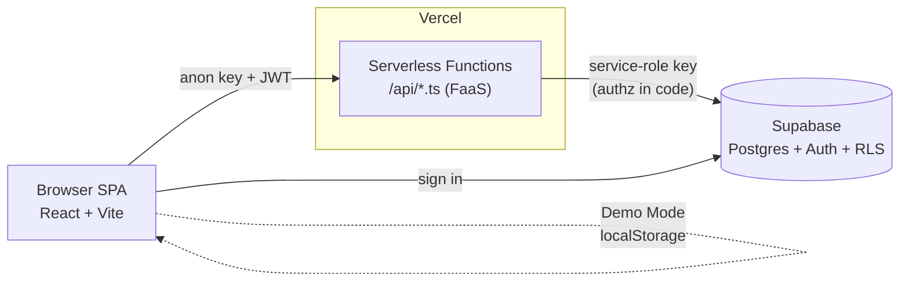
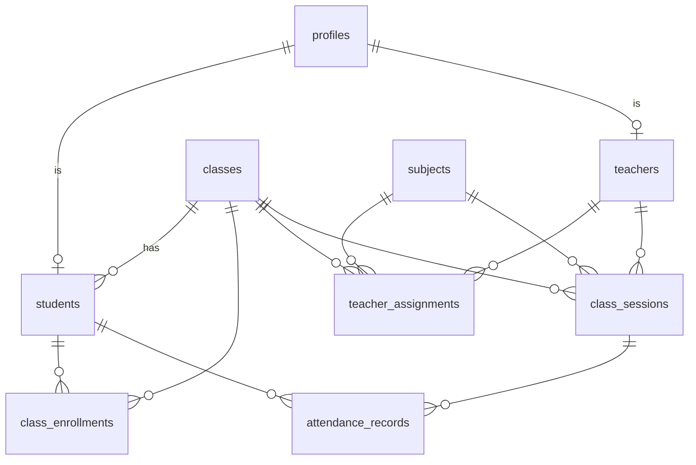

# AttendX — Serverless Smart Attendance & Analytics System

A premium MSc IT mini-project demonstrating **serverless architecture**: a React + Vite SPA, **Vercel Serverless Functions** for the API, and **Supabase** (PostgreSQL + Auth + RLS) as the managed backend. It runs **fully offline in Demo Mode** (no cloud credentials needed) and upgrades to **Cloud Mode** with real auth and a real database.

> Institution in the data: *Coastal Institute of Technology* (fictional — no real personal data).

---

## 1. Features

- **Three roles** — Admin, Teacher, Student — each with protected routes and server-side authorization.
- **Admin**: institution stats, 7/30-day trends, subject & class comparison charts, student/teacher/class/subject management, CSV reports, audit log.
- **Teacher**: assigned classes/subjects, mark present/absent/late/excused, "mark all present", edit with mandatory reason + audit trail, analytics, reports.
- **Student**: overall %, subject-wise cards, present/absent/late counts, monthly chart, history, upcoming classes, **< 75% warning** with "attend *x* more consecutive classes to recover".
- **Accurate attendance maths** with a documented policy and a **unit-test suite**.
- **Demo Mode** (localStorage, resettable) and **Cloud Mode** behind one shared repository interface.
- Dark SaaS UI: collapsible sidebar, search, filters, toasts, confirm dialogs, skeletons, empty/error states, keyboard-accessible.

## 2. Tech stack

React + Vite + TypeScript · Tailwind CSS · Recharts · Lucide · Zod · Vercel Serverless Functions · Supabase (Postgres/Auth/RLS).

## 3. Quick start (Demo Mode — no credentials)

```bash
npm install
npm run dev          # http://localhost:5173
```

Pick any account on the login screen (Admin / Teacher / Student). No password needed. Use **Reset** (top bar) to restore the seed. Demo Mode shows a clear banner and never claims cloud persistence.

```bash
npm test             # attendance-logic unit tests
npm run build        # typecheck + production build
```

## 4. Demo accounts

| Role | Selector label | Notes |
|------|----------------|-------|
| Admin | Administrator | full institution view |
| Teacher | Dr. Suresh Kamath | assigned to several class/subjects |
| Student | healthy attendance | above threshold |
| Student | at risk | below 75% — shows recovery guidance |

## 5. Switching to Cloud Mode

1. Create a Supabase project. In the SQL editor run, in order:
   `supabase/migrations/0001_schema.sql` then `0002_rls.sql`.
2. Copy `.env.example` → `.env` and set:
   - `VITE_APP_MODE=cloud`
   - `VITE_SUPABASE_URL`, `VITE_SUPABASE_ANON_KEY` (publishable — safe for browser)
   - `SUPABASE_URL`, `SUPABASE_SERVICE_ROLE_KEY` (**server only**, never `VITE_`)
3. Seed the database (reuses the demo dataset):
   ```bash
   SUPABASE_URL=... SUPABASE_SERVICE_ROLE_KEY=... npx vite-node scripts/seed-supabase.ts
   ```
   All seeded users share the password printed by the script (demo only).
4. Run `vercel dev` (serves the SPA and the `/api` functions together).

> The service-role key bypasses RLS and is used **only** inside the serverless functions, which authorize every request in code. RLS policies are defense-in-depth for the public anon key. The service key is never exposed to the frontend and never placed in a `VITE_` variable.

## 6. Deploy to Vercel

```bash
npm i -g vercel
vercel            # link project
# In Vercel → Project → Settings → Environment Variables, add:
#   VITE_APP_MODE=cloud, VITE_SUPABASE_URL, VITE_SUPABASE_ANON_KEY,
#   SUPABASE_URL, SUPABASE_SERVICE_ROLE_KEY, ATTENDANCE_THRESHOLD
vercel --prod
```

`vercel.json` sets the Vite framework preset, the `/api/**` function config, and an SPA rewrite.

## 7. Architecture



- **Demo Mode**: `DemoRepository` runs the shared selectors against localStorage.
- **Cloud Mode**: `CloudRepository` calls `/api`; functions verify the JWT, authorize by DB role, run the **same** shared selectors on data loaded from Supabase.

## 8. Database ER diagram



`attendance_records` has `UNIQUE(session_id, student_id)` — no duplicate attendance per student per session. `profiles.id` equals the Supabase `auth.users.id`.

## 9. Attendance policy (and why it's correct)

Per subject, over **completed** sessions only:

```
percentage = (present + late) / eligible * 100
eligible   = present + late + absent
```

| Status | In numerator | In denominator |
|--------|:---:|:---:|
| present | ✔ | ✔ |
| late | ✔ | ✔ (shown separately) |
| absent | ✘ | ✔ |
| excused | ✘ | ✘ (excluded by policy) |
| cancelled session | ✘ | ✘ |
| scheduled / unmarked | ✘ | ✘ |

**Recovery target** — smallest `x` future consecutive attended sessions to reach threshold `T`:
`(attended + x) / (eligible + x) ≥ T  ⇒  x ≥ (T·eligible − attended) / (1 − T)`.
With zero eligible sessions the target is "not applicable" rather than a misleading number. Covered by `shared/attendance.test.ts` (zero, 100%, exactly 75%, below 75%, late, cancelled, excused).

## 10. API (URL → file, file-based routing)

All responses use `{ ok: true, data } | { ok: false, error, code }`. Every function: validates method → authenticates JWT → authorizes by DB role → validates with Zod → runs DB ops → returns typed JSON. Errors never leak internals.

| Method | URL | File | Role |
|---|---|---|---|
| GET | `/api/me` | `api/me.ts` | any |
| GET | `/api/dashboard/stats` | `api/dashboard/stats.ts` | admin |
| GET/POST | `/api/students` | `api/students/index.ts` | admin |
| PATCH | `/api/students/:id` | `api/students/[id].ts` | admin |
| GET/POST | `/api/teachers` | `api/teachers.ts` | admin |
| GET/POST | `/api/classes` | `api/classes.ts` | any read / admin write |
| GET/POST | `/api/subjects` | `api/subjects.ts` | any read / admin write |
| GET | `/api/assignments` | `api/assignments.ts` | admin |
| GET | `/api/roster?classId=` | `api/roster.ts` | teacher/admin |
| POST | `/api/sessions` | `api/sessions.ts` | teacher |
| GET/POST | `/api/attendance` | `api/attendance.ts` | teacher/admin |
| GET | `/api/teacher/overview` | `api/teacher/overview.ts` | teacher |
| GET | `/api/student/overview` | `api/student/overview.ts` | student |
| GET | `/api/analytics` | `api/analytics.ts` | admin/teacher |
| GET | `/api/reports/attendance` | `api/reports/attendance.ts` | admin/teacher |
| GET | `/api/audit-logs` | `api/audit-logs.ts` | admin |

**Example** — `POST /api/attendance`
```jsonc
// request
{ "sessionId": "…", "reason": "roll-call correction",
  "entries": [{ "studentId": "…", "status": "present" }] }
// response
{ "ok": true, "data": { "saved": 1 } }
```

## 11. How this demonstrates serverless computing

- **FaaS / on-demand execution**: each `/api/*.ts` is an independent function invoked per request; no always-on server.
- **Stateless requests**: functions hold no session state between calls — identity comes from the verified JWT each time (the in-memory rate-limiter is best-effort per warm instance, noted as a limitation).
- **Managed database**: Supabase Postgres — no DB server to operate.
- **Automatic scaling / reduced ops**: Vercel scales instances with traffic; no provisioning, patching, or capacity planning.
- **Pay-per-use & its limits**: billed per invocation/duration; trade-offs are **cold starts**, execution-time/memory **quotas** (`maxDuration` 10s here), added **latency** on cold paths, and **vendor lock-in** to the platform's function/runtime model.
- **Serverless vs traditional**: no Express/EC2/Docker long-running process; deploy is a push, scaling is implicit, cost tracks usage rather than reserved capacity.

## 12. Viva Q&A (short)

- **What is serverless?** Running code as managed, event-triggered functions without provisioning servers; the provider handles scaling and availability.
- **Are there really no servers?** There are, but the provider manages them; you deploy functions, not machines.
- **What is a cold start?** First invocation after idle spins up a new instance → extra latency; warm instances are reused.
- **Why keep secrets server-side?** The anon key is public and RLS-bound; the service-role key bypasses RLS, so it stays only in functions.
- **Why both server authz and RLS?** Functions authorize explicitly; RLS protects any direct anon-key access — layered defense.
- **How are duplicates prevented?** `UNIQUE(session_id, student_id)` plus upsert-style save logic.

## 13. Project structure

```
api/                 Vercel serverless functions (+ _lib shared helpers)
shared/              types, attendance logic (+ tests), selectors, seed data
src/
  components/        ui/ primitives, charts/, layout/, StatCard
  context/           AuthContext
  hooks/             useAsync
  pages/             login, dashboards/, management, mark, history, analytics, reports, audit, profile
  repo/              Repository interface + demoRepo + cloudRepo + mode switch
supabase/migrations/ 0001_schema.sql, 0002_rls.sql
scripts/             seed-supabase.ts
```

## 14. 5–7 minute demo script

1. **(0:30)** Show login + the **DEMO MODE** banner; explain no cloud needed.
2. **(1:00)** Sign in as **Student (at risk)** — overall %, subject cards, the < 75% warning and recovery count, monthly chart.
3. **(1:30)** Sign in as **Teacher** — open **Mark Attendance**, pick class/subject/date, "all present", change two to absent/late, **Save** (toast).
4. **(1:00)** Re-open the same session, change one status → a **reason is required**; save → open **Audit Log** as Admin to show the before→after entry.
5. **(1:30)** Sign in as **Admin** — stat cards, trends, subject/class charts (all computed from records), **Reports** → filter → **Export CSV**.
6. **(0:30)** Click **Reset** to restore the seed; note the same code path runs against Supabase in Cloud Mode.

## 15. Mini-project report outline

Introduction & objectives · Serverless background (FaaS, scaling, pricing) · Requirements · System architecture (diagrams §7–8) · Database design & RLS · Attendance algorithm & tests (§9) · API design (§10) · Security (RLS, Zod, server authz, secrets, rate/size limits) · Demo vs Cloud mode · Results/screenshots · Serverless evaluation & limitations (cold starts, quotas, lock-in) · Conclusion & future work.

## 16. Limitations

- Cloud Mode requires a Supabase project + the full service-role key (the one provided was masked).
- Rate limiting is per warm instance (best-effort), not a global quota.
- The app has been **built, typechecked, and unit-tested locally**; it has **not** been deployed to Vercel or run against a live Supabase instance in this repository.
```
